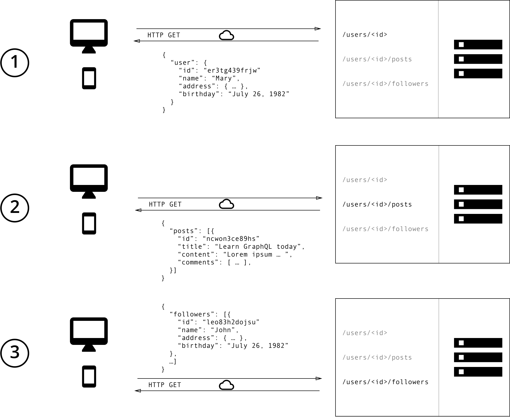
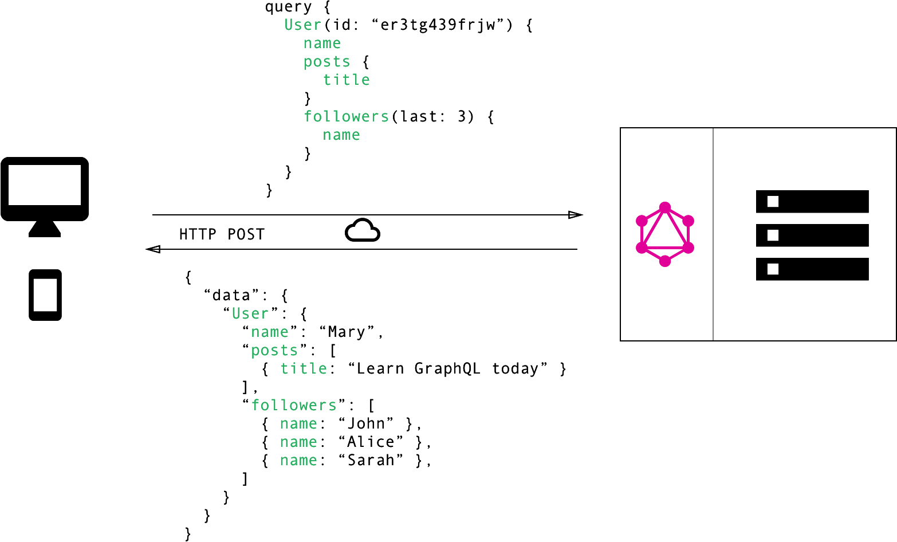

# GrapqQL
GraphQL is a new API standard that provides a more efficient, powerful and flexible alternative to REST.

## GraphQL is the better than REST
  ### Data fetching with GraphQL and REST
  - REST
  
  - GraphQL
  

## REST
  ### OverFetching
    eg. 列表需要展示用户的名称和用户发布的文章的标题
    One of the most common problems with REST is that of over- and underfetching. This happens because the only way for a client to download data is by hitting endpoints that return fixed data structures.
## Core concept
### The Schema Definition Language
GraphQL has its own type system that’s used to define the schema of an API

```
type Person {
  name: String!
  age: Int!
}
```
```
type Post {
  title: String!
  author: Person!
}
```
